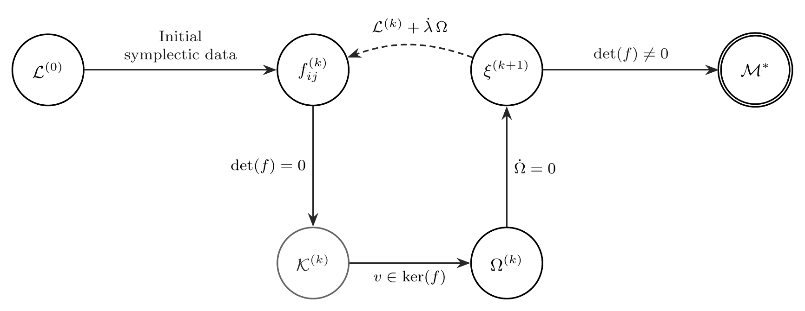
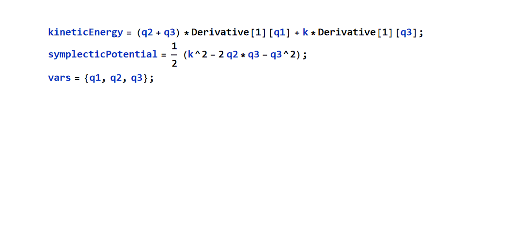

[](https://doi.org/10.5281/zenodo.18487436)


# BorderedFJReduction
Symbolic engine for the Faddeev–Jackiw reduction based on geometrically constrained matrix bordering.

>**BorderedFJReduction** is a symbolic computational engine for the Faddeev–Jackiw reduction of constrained systems, implemented as a geometrically structured instance of the matrix bordering technique.
>
>The package is designed for analytical work on singular Lagrangians with finite degrees of freedom, emphasizing explicit constraint propagation, rank diagnostics, and transparent handling of gauge symmetries.
>
>**Project status:** active development. The theoretical formulation and software architecture are aligned with a research manuscript currently in preparation, and the package is intended as a reusable and extensible research tool rather than a black-box numerical routine.

___

## 📦 BorderedFJReduction
<p align="center">  </p> <p align="left"> <b>Conceptual flow of the bordered Faddeev–Jackiw reduction, highlighting constraint propagation, rank diagnostics, and gauge symmetry detection.</b> </p>

___

## 🔍 Overview

BorderedFJReduction is a Wolfram Language paclet that provides a fully symbolic implementation of the Faddeev–Jackiw (FJ) reduction for singular Lagrangian systems.

The core contribution of this project is the realization that the FJ iterative extension of phase space is not a heuristic procedure, but a geometrically constrained instance of the Matrix Bordering Technique (MBT).
This insight enables a deterministic, transparent, and automatable reduction process, preserving full parametric dependence throughout the computation.

The engine returns an opaque symbolic object encapsulating the complete symplectic hierarchy, while exposing its internal structure through a controlled, queryable interface.

___

## ✨ Key Features

- Fully symbolic Faddeev–Jackiw reduction

- Matrix Bordering–based formulation (theorem-driven, not procedural)

- Automatic detection of:

- Regular symplectic manifolds

- Constraint hierarchies

- Gauge symmetries (null or dependent constraints)

- Preservation of parametric dependence (essential for bifurcation and stability analysis)

- Structured output via Wolfram SummaryBox

- Queryable association interface for downstream analysis

- Publication-ready visualization of generalized symplectic brackets

___

## 📐 Conceptual Architecture

The reduction process is internally organized as a causal graph of symbolic states, rather than a linear algorithm.
Each iteration corresponds to a bordered extension of the symplectic 2-form until regularity or gauge redundancy is detected.

This mirrors the interpretation developed in the accompanying manuscript:

> The Faddeev–Jackiw procedure is a geometrically constrained matrix bordering process acting on symbolic symplectic data.
___

## 📑 Table of Contents

- [🔧 Minimum Requirements](#-minimum-requirements)
- [🚀 Installation](#-installation)
- [🧪 Basic Usage](#-basic-usage)
- [🧩 API Summary](#-api-summary)
- [🧭 Gauge Symmetry Detection](#-gauge-symmetry-detection)
- [📚 Scientific Context and Related Work](#-scientific-context-and-related-work)
- [📝 Editorial Status](#-editorial-status)
- [👥 Authors](#-authors)
- [🔮 Future Directions](#-future-directions)
- [🙏 Acknowledgements](#-acknowledgements)
- [📄 License](#-license)
- [📌 Citation and DOI](#-citation-and-doi)
- [📋 Development](#-development)

## 🔧 Minimum Requirements

- Wolfram Language / Mathematica **13.0 or later**
- Wolfram Workbench (Eclipse-based IDE) — *optional but recommended*
- Tested on Windows, macOS, and Linux

## 🚀 Installation
### Option 1: Install directly from GitHub (recommended)

```mathematica
PacletInstall[
  "https://github.com/echanlopez/BorderedFJReduction/releases/download/v0.1.2/BorderedFJReduction-0.1.1.paclet",
  ForceVersionInstall -> True
]
```
Then load the package:

```mathematica
Needs["BorderedFJReduction`"]
```
### Option 2: Local installation (development)

```mathematica
PacletInstall["/path/to/BorderedFJReduction-0.1.1.paclet"]
```

> **Note:** Release v0.1.2 supersedes earlier archived versions and corrects
> a paclet packaging issue without modifying the underlying algorithm.
___

## 🧪 Basic Usage

A minimal invocation returns a structured symbolic object summarizing the
regularization status, constraint geometry, and phase-space extension of the system.

Example shown below: Faddeev–Jackiw reduction of the Hojman–Urrutia Lagrangian
(details omitted for clarity; see the Examples/ folder for the full definition).

```mathematica
Needs["BorderedFJReduction`"]
```
The following animation illustrates only the final symbolic structured output for a typical reduction.

<p align="left">
  
</p>

🔎 **Notes on the example**

- The GIF intentionally displays the full input and the summary output.

- The underlying Lagrangian contains physical parameters preserved symbolically.

- This reflects the package philosophy:
structure and diagnostics first, raw expressions second.

In practice, the output of `BorderedFJMatrix` is typically assigned to a symbolic
object. This allows direct programmatic access to the internal structures generated
by the reduction, such as constraints, extended symplectic matrices, and iteration
metadata.

```mathematica
bfj = BorderedFJMatrix[kineticEnergy, symplecticPotential, vars];
```
The returned object supports the following query interface:

```mathematica
bfj["Constraints"]
bfj["ExtendedMatrix"]
bfj["ExtendedOneForm"]
bfj["ExtendedSymplecticVariables"]
bfj["InverseExtendedMatrix"]
bfj["IterationCount"]
bfj["MatrixStatus"]
```

To visualize the generalized symplectic brackets in a structured,
publication-ready format:

```mathematica
FJSymplecticFrame[bfj]
```

<p align="left">
  
</p>

**Note:** The visualization shows the extended symplectic structure with publication-ready formatting, including the inverse matrix (generalized brackets) and diagnostic information.

## 🧩 API Summary

The object returned by `BorderedFJMatrix` is intentionally opaque but fully queryable:

- `"Constraints"` — generated constraint functions
- `"ExtendedMatrix"` — final bordered symplectic matrix
- `"ExtendedOneForm"` — extended canonical one-form
- `"ExtendedSymplecticVariables"` — phase-space variables
- `"InverseExtendedMatrix"` — generalized symplectic brackets
- `"IterationCount"` — number of FJ iterations required for regularization
- `"MatrixStatus"` — `"Regular"` or `"Singular"`
___

## 🧭 Gauge Symmetry Detection

If the reduction fails to reach a regular symplectic manifold, the engine automatically diagnoses gauge redundancy:

- **Null constraints** (identically zero)

- **Dependent constraints** (no further restriction of phase space)

In such cases, the final pre-symplectic matrix and its null vectors are preserved, providing direct access to the generators of gauge transformations.

___


## 📚 Scientific Context and Related Work

The theoretical foundation of this package is rooted in the geometric formulation of constrained dynamics introduced by Faddeev and Jackiw, which recasts singular Lagrangian systems in terms of pre-symplectic structures rather than hierarchical constraint classifications.

The full iterative power of the method was developed by Barcelos-Neto and Wotzasek, who established a systematic procedure for extending the phase space until either a regular symplectic manifold or a gauge symmetry is revealed.

From a linear algebra perspective, the present implementation makes explicit the connection between the Faddeev–Jackiw iteration and the Matrix Bordering Technique, a classical tool in numerical analysis and bifurcation theory for handling rank-deficient operators and structured singularities.

Recent developments in computational and algorithmic physics have emphasized the role of symbolic rewriting systems and causal structures in the formulation of physical laws. In this spirit, **BorderedFJReduction** treats constrained dynamics as a deterministic transformation of symbolic states, rather than as a procedural manipulation of equations.

As a result, the package complements existing symbolic approaches to constrained systems and is particularly well suited for studies where parametric dependence, bifurcation structure, and exact constraint algebra play a central role.

This package accompanies the theoretical development presented in:

> **Faddeev–Jackiw Reduction of Singular Lagrangians:  
> A Matrix Bordering Approach with Symbolic Implementation**

The implementation has been validated on:

- The Hojman–Urrutia model  
- Singular mechanical systems analyzed within the Dirac–Bergmann framework  
- Systems exhibiting gauge symmetry

>**These examples illustrate how the symbolic engine bridges abstract symplectic geometry with concrete mechanical realizations.**

___

## 📝 Editorial Status

This paclet accompanies the manuscript

> **Faddeev–Jackiw Reduction of Singular Lagrangians:  
> A Matrix Bordering Approach with Symbolic Implementation**

which is currently in preparation for submission and public dissemination.

The present release corresponds to a **development version** of the symbolic engine, intended to:
- establish computational reproducibility,
- provide an inspectable implementation of the theoretical results,
- and enable early technical validation by the community.

The scientific priority of the underlying theoretical framework is fully documented in the accompanying manuscript.
___

## 👥 Authors

- Ramón Eduardo Chan López (SECIHTI-DACB-UJAT)

- José Alberto Martín Ruiz (ICN-UNAM, C3-UNAM)

- Jaime Manuel Cabrera (SECIHTI-DACB-UJAT)

- Jorge Mauricio Paulin Fuentes (DACB-UJAT)

___

## 🔮 Future Directions

The current engine targets finite-dimensional systems (point mechanics).
However, its algebraic architecture is designed as a kernel for future extensions toward:

- Field theories
- Symbolic tensor calculus
- Infinite-dimensional constraint surfaces
- Gauge theories (Maxwell, Yang–Mills)

The long-term vision is a Tensor Faddeev–Jackiw Engine, where constraint handling emerges directly from the algebraic structure of the symplectic form.
**Extension to infinite-dimensional settings (remarks)**
The algebraic logic underlying matrix bordering admits operator-theoretic generalizations.
In particular, Schur complements have been systematically studied for bounded and
complementable operators on Hilbert spaces, providing a mathematically consistent framework for infinite-dimensional extensions under suitable analytic hypotheses.

**References on Matrix Bordering and Schur Complements:**

- G. H. Golub and C. F. Van Loan, Matrix Computations, 4th ed., Johns Hopkins University Press (2013).
Chapter 3 discusses matrix bordering techniques and their applications in numerical linear algebra.
- C. Băcuţa, Schur complements on Hilbert spaces, Journal of Computational and Applied Mathematics 231 (2009).
https://www.sciencedirect.com/science/article/pii/S0377042708004305
Provides operator-theoretic generalization relevant to infinite-dimensional extensions.
___

## 🙏 Acknowledgements

The lead developer of the software would like to acknowledge **[Eric Rimbey](https://community.wolfram.com/web/eric3)** for his critical feedback and rigorous code reviews during the early stages of this project.

His emphasis on immutability, explicit semantic structure, and disciplined control of symbolic state played a decisive role in shaping the final design philosophy of the engine. Several aspects of the current implementation—particularly its rule-based structure and transparent error handling—are a direct consequence of those early discussions.

Contributions of this kind, grounded in systems thinking and semantic rigor, are fundamental to the maturation of reliable scientific software, even when their impact is primarily architectural rather than directly visible in the final code.

___

## 📄 License

This project is released under the MIT License.

The software is intended for academic and research use, providing a transparent and reproducible implementation of the methods described in the accompanying manuscript.

___
## 📌 Citation and DOI

If you use this software in academic work, please cite it using the following DOIs:

- **Concept DOI (all versions):** https://doi.org/10.5281/zenodo.18362979  
- **Version-specific DOI (v0.1.2 – recommended):** https://doi.org/10.5281/zenodo.18487436
___

## BibTeX Citation

If you use **BorderedFJReduction** in your research, please cite the accompanying work:

### Article

```bibtex
@article{ChanMartinBorderedFJReduction,
  title   = {Faddeev--Jackiw Reduction of Singular Lagrangians:
             A Matrix Bordering Approach with Symbolic Implementation},
  author  = {Chan L{\'o}pez, Ram{\'o}n Eduardo and
             Mart{\'\i}n Ruiz, Jos{\'e} Alberto and
             Cabrera, Jaime Manuel and
             Paulin Fuentes, Jorge Mauricio},
  journal = {arXiv preprint},
  year    = {2026},
  note    = {The Faddeev--Jackiw algorithm is formulated as a geometrically
             constrained instance of the Matrix Bordering Technique.
             A symbolic implementation is provided via the
             \texttt{BorderedFJReduction} Wolfram Language paclet.}
}
```
### Software

```bibtex
@software{ChanLopez_BorderedFJReduction_2026,
  author    = {Chan L{\'o}pez, Ram{\'o}n Eduardo and
               Mart{\'\i}n Ruiz, Jos{\'e} Alberto and
               Cabrera, Jaime Manuel and
               Paulin Fuentes, Jorge Mauricio},
  title     = {BorderedFJReduction: A Symbolic Engine for the Faddeev--Jackiw Reduction},
  version   = {0.1.1},
  year      = {2026},
  publisher = {Zenodo},
  doi       = {10.5281/zenodo.18362980},
  url       = {https://github.com/echanlopez/BorderedFJReduction}
}
```

## 📋 Development

For maintainers and contributors:

- [Release checklist](docs/RELEASE_CHECKLIST.md)
