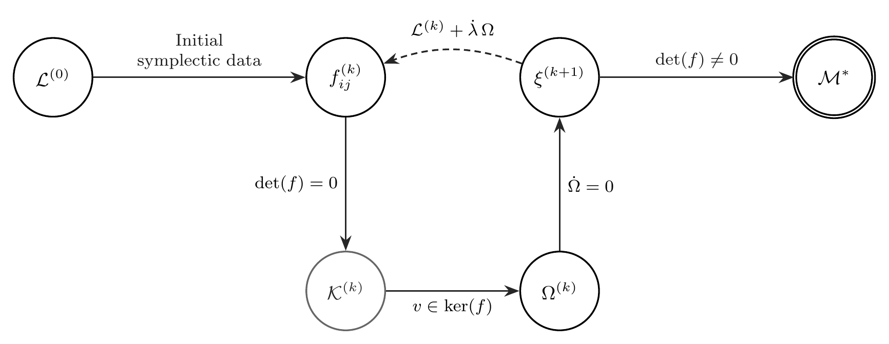
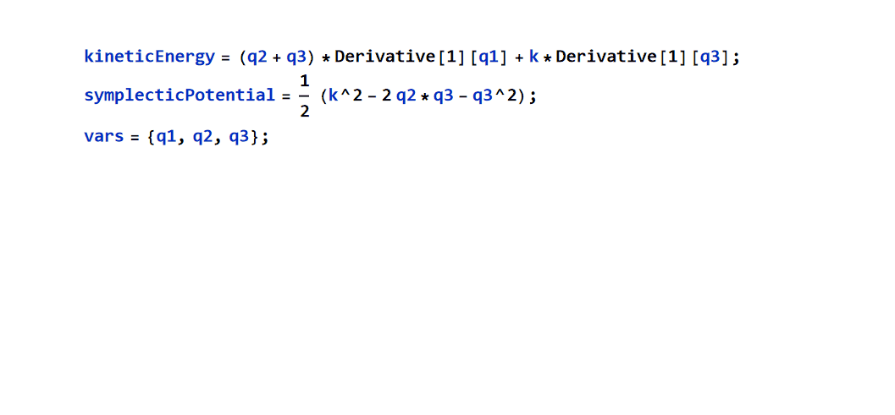
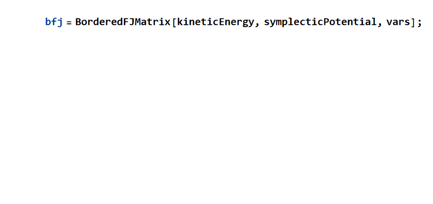

[](https://doi.org/10.5281/zenodo.18487436)


# BorderedFJReduction
Matrix bordering structure of the Faddeev-Jackiw algorithm: kernel reduction and symbolic automation.

> **BorderedFJReduction** is a symbolic computational engine that formalizes the Faddeev–Jackiw (FJ) reduction of singular Lagrangian systems as a geometrically constrained instance of the **Matrix Bordering Technique (MBT)**.
>
> Each consistency step of the Barcelos–Neto–Wotzasek algorithm is realized as a bordering of the pre-symplectic matrix. Because the pre-symplectic form is singular by hypothesis, the regularity of the resulting extended matrix is decided not by any inverse of that matrix, but by the **reduction to its null space**: the *reduced constraint matrix* $\Gamma = N^{\top} B$, built from the pairing of the constraint gradients with a basis $N$ of $\ker(f^{(0)})$, controls termination through an exact determinant factorization and coincides, coefficient by coefficient, with the Faddeev–Jackiw constraint algebra.
>
> **Project status:** The theoretical formulation and software architecture correspond to the article **"Matrix bordering structure of the Faddeev-Jackiw algorithm: kernel reduction and symbolic automation"** (2026), available at [arXiv:2602.12114](https://arxiv.org/abs/2602.12114). The package is designed for analytical work on singular Lagrangians, emphasizing explicit constraint propagation and regularity diagnostics via null-space reduction and the reduced constraint matrix.

___

## 📦 BorderedFJReduction
<p align="center">  </p> <p align="left"> <b>Conceptual flow of the bordered Faddeev–Jackiw reduction, highlighting constraint propagation, null-space coupling, and gauge symmetry detection.</b> </p>

___

## 🔍 Overview

BorderedFJReduction is a Wolfram Language paclet that provides a fully symbolic implementation of the Faddeev–Jackiw (FJ) reduction for singular Lagrangian systems.

The core contribution of this project is the realization that the FJ iterative extension of phase space is not a heuristic procedure, but a **geometrically constrained instance of the Matrix Bordering Technique (MBT)**, whose termination is governed by the reduction of the bordered matrix to the null space of the pre-symplectic form. This insight enables a deterministic, transparent, and automatable reduction process, preserving full parametric dependence throughout the computation.

The engine returns an opaque symbolic object encapsulating the complete symplectic hierarchy, while exposing its internal structure through a controlled, queryable interface.

### Mathematical Foundation

For a first-order Lagrangian $L = a_i(\xi)\,\dot\xi^{\,i} - V(\xi)$ with singular pre-symplectic two-form $f^{(0)}_{ij} = \partial_i a_j - \partial_j a_i$, each iteration of the Barcelos–Neto–Wotzasek algorithm produces an antisymmetric **bordered** matrix

$$
f^{(m)} = \begin{pmatrix} f^{(0)} & B \\ -B^{\top} & 0 \end{pmatrix},
$$

where 

$$
B_{j\alpha}
=
\frac{\partial\Omega_\alpha}{\partial\xi^j}.
$$
Here, the bordering block $B$ collects the gradients of the consistency constraints $\Omega_\alpha$. Since $f^{(0)}$ is singular, its inverse — and hence any determinantal identity that presupposes an invertible anchor — is unavailable. Regularity is instead controlled by how $B$ couples to $\ker(f^{(0)})$.

Let the columns of $N \in \mathbb{R}^{n\times d}$ be an orthonormal basis of $\ker(f^{(0)})$, with $d = \dim\ker(f^{(0)})$, and define the **reduced constraint matrix**

$$
\Gamma = N^{\top} B \in \mathbb{R}^{d\times k}, \qquad \Gamma_{a\alpha} = N_a^{i}\partial_i \Omega_\alpha .
$$

Eliminating the invertible symplectic core of $f^{(0)}$ by an orthogonal congruence yields the **exact determinant factorization**

$$
\det\big(f^{(m)}\big) = \Big(\prod_{\ell} \mu_\ell^{2}\Big)\,\det(\Gamma)^2, \qquad \mu_\ell > 0,
$$

where the $\mu_\ell$ are the Pfaffian factors of the nonsingular block of $f^{(0)}$. Because the prefactor is strictly positive, the extended matrix is regular **if and only if** the number of independent generated constraints equals $d$ and $\Gamma$ is nonsingular:

$$
\det\big(f^{(m)}\big) \neq 0 \iff k = d \ \text{ and }\ \det(\Gamma) \neq 0 .
$$

The central algebraic result is the **kernel–Poisson identity**: when the constraints arise from the consistency condition, the reduced matrix equals, coefficient by coefficient, the Hessian of the symplectic potential restricted to the null space,

$$
\Gamma_{\alpha\beta} = N_\alpha^{i}\big(\partial_i\partial_j V\big)N_\beta^{j} = \{\Omega_\alpha,\Omega_\beta\}_{\mathrm{FJ}},
$$

which is precisely the constraint matrix whose nondegeneracy characterizes a second-class system in the Dirac–Bergmann sense. This is an **exact matrix equality** — not an isomorphism, a congruence, or a relation valid only on the constraint surface.

The package automates the corresponding workflow:

* **Kernel reduction:** computes $\ker(f^{(0)})$ and the reduced constraint matrix $\Gamma = N^{\top}B$ that governs regularity.
* **Exact correspondence:** links the regularity of the bordered matrix directly to the second-class structure of the constraints through the kernel–Poisson identity.
* **Gauge diagnostics:** exposes the surviving null generators when the reduction halts with a residual kernel (first-class / gauge content).

> *Under the assumption that the generated constraints are independent and the consistency algorithm has been run to exhaustion, the Faddeev–Jackiw reduction terminates in a nondegenerate symplectic form if and only if $\Gamma$ is nonsingular, i.e. the system is second-class.*

-----

## ✨ Key Features

- Fully symbolic implementation of the Faddeev–Jackiw reduction
- Theorem-driven formulation based on the Matrix Bordering Technique (not a procedural algorithm)
- **Kernel (null-space) reduction** of singular pre-symplectic matrices via the reduced constraint matrix $\Gamma = N^{\top}B$
- Regularity governed by the exact determinant factorization $\det(f^{(m)}) = \big(\prod_\ell \mu_\ell^2\big)\det(\Gamma)^2$
- Automatic detection and classification of:
  - Regular symplectic manifolds
  - Constraint hierarchies generated by consistency conditions
  - Gauge symmetries, including null and linearly dependent constraints
- Exact preservation of parametric dependence throughout the reduction process
   (essential for bifurcation, stability, and structural analysis)
- Structured symbolic output encapsulated in a Wolfram `SummaryBox`
- Opaque but fully queryable association-based interface for downstream analysis
- Direct access to:
  - Extended symplectic matrices
  - Generalized symplectic brackets
  - Constraint algebra and iteration metadata
- Publication-ready visualization of generalized symplectic structures

___

## 📐 Conceptual Architecture

The reduction process is internally organized as a **directed dependency graph** of symbolic states, rather than a linear algorithm.
Each iteration corresponds to a bordered extension of the symplectic 2-form until regularity or a residual kernel (gauge redundancy) is detected.

This mirrors the interpretation developed in the accompanying manuscript, where such graphs are called *causal* only in the rewriting-system sense of the Wolfram Physics Project:

> The Faddeev–Jackiw procedure is a geometrically constrained matrix bordering process acting on symbolic symplectic data, whose termination is decided by the reduction to the null space of the pre-symplectic form.
___

## 📑 Table of Contents

- [🔧 Minimum Requirements](#-minimum-requirements)
- [🚀 Installation](#-installation)
- [🧪 Basic Usage](#-basic-usage)
- [🧩 API Summary](#-api-summary)
- [🧭 Gauge Symmetry Detection](#-gauge-symmetry-detection)
- [📚 Scientific Context and Related Work](#-scientific-context-and-related-work)
- [📝 Editorial Status](#-editorial-status)
- [👥 Authors](#-authors)
- [🔮 Future Directions](#-future-directions)
- [🙏 Acknowledgements](#-acknowledgements)
- [📄 License](#-license)
- [📌 Citation and DOI](#-citation-and-doi)
- [📋 Development](#-development)

## 🔧 Minimum Requirements

- Wolfram Language / Mathematica **13.0 or later**
- Wolfram Workbench (Eclipse-based IDE) — *optional but recommended*
- Tested on Windows, macOS, and Linux

## 🚀 Installation
### Option 1: Install directly from GitHub (recommended)

```mathematica
PacletInstall[
  "https://github.com/echanlopez/BorderedFJReduction/releases/download/v0.1.2/BorderedFJReduction-0.1.2.paclet",
  ForceVersionInstall -> True
]
```
Then load the package:

```mathematica
Needs["BorderedFJReduction`"]
```
### Option 2: Local installation (development)

```mathematica
PacletInstall["/path/to/BorderedFJReduction-0.1.2.paclet"]
```

> **Note:** Release v0.1.2 supersedes earlier archived versions and corrects
> a paclet packaging issue (context isolation and symbol leakage),
> without modifying the underlying algorithm or mathematical formulation.

## 🧪 Basic Usage

A minimal invocation returns a structured symbolic object summarizing the
regularization status, constraint geometry, and phase-space extension of the system.

Example shown below: Faddeev–Jackiw reduction of the Singular Lagrangian with noncanonical kinetics
(details omitted for clarity; see the Examples/ folder for the full definition).

```mathematica
Needs["BorderedFJReduction`"]
```
The following animation illustrates only the final symbolic structured output for a typical reduction.

<p align="left">
  
</p>

🔎 **Technical notes**

- **Input/Output shown:** The animation displays the complete Lagrangian specification alongside the reduction's structured summary.

- **Parametric preservation:** Physical parameters (e.g., masses, spring constants, coupling terms) remain symbolic throughout the computation, enabling sensitivity analysis and parametric bifurcation studies without re-execution.

- **Design philosophy:** The output prioritizes *diagnostic information* (rank, iteration count, regularity status) over raw symbolic expressions, consistent with the package's emphasis on geometric structure rather than algebraic manipulation.

In practice, the output of `BorderedFJMatrix` is typically assigned to a symbolic
object. This allows direct programmatic access to the internal structures generated
by the reduction, such as constraints, extended symplectic matrices, and iteration
metadata.

```mathematica
bfj = BorderedFJMatrix[kineticEnergy, symplecticPotential, vars];
```
The returned object supports the following query interface:

```mathematica
bfj["Constraints"]
bfj["ExtendedMatrix"]
bfj["ExtendedOneForm"]
bfj["ExtendedSymplecticVariables"]
bfj["InverseExtendedMatrix"]
bfj["IterationCount"]
bfj["MatrixStatus"]
```

Here `"MatrixStatus"` reports the outcome of the regularity criterion
$\det(f^{(m)}) \neq 0 \iff \det(\Gamma) \neq 0$: it returns `"Regular"` when the
reduced constraint matrix is nonsingular (a second-class system) and `"Singular"`
when a residual kernel survives (first-class / gauge content). The generated
`"Constraints"` are the functions $\Omega_\alpha$ whose gradients form the
bordering block $B$, and `"InverseExtendedMatrix"` returns the generalized
symplectic brackets of the regularized theory.

To visualize the generalized symplectic brackets in a structured,
publication-ready format:

```mathematica
FJSymplecticFrame[bfj]
```

<p align="left">
  
</p>

**Note:** The visualization shows the extended symplectic structure with publication-ready formatting, including the inverse matrix (generalized brackets) and diagnostic information.

## 🧩 API Summary

The object returned by `BorderedFJMatrix` is intentionally opaque but fully queryable:

- `"Constraints"` — generated constraint functions $\Omega_\alpha$
- `"ExtendedMatrix"` — final bordered symplectic matrix $f^{(m)}$
- `"ExtendedOneForm"` — extended canonical one-form
- `"ExtendedSymplecticVariables"` — augmented phase-space variables (including Lagrange multipliers)
- `"InverseExtendedMatrix"` — generalized symplectic brackets
- `"IterationCount"` — number of FJ iterations required for regularization
- `"MatrixStatus"` — `"Regular"` (nonsingular $\Gamma$) or `"Singular"` (residual kernel)
___

## 🧭 Gauge Symmetry Detection

If the reduction halts with a residual kernel — i.e. $\det(\Gamma) = 0$ — the extended matrix is not regularized and the engine reports the two structural signatures that produce this outcome:

- **Null constraints** (the consistency condition is satisfied identically)

- **Dependent constraints** (new constraints do not restrict the phase space further)

In such cases the final pre-symplectic matrix and its null vectors are preserved, exposing the **candidate generators** of the gauge transformations. A residual kernel is a *necessary* signature of first-class constraints; confirming a genuine gauge symmetry additionally requires that the surviving null modes $v$ satisfy $v^{i}\partial_i V = 0$ (otherwise the halt reflects an inconsistent system rather than a gauge one). The engine therefore exposes the candidate generators and leaves the physical confirmation to the user.

___


## 📚 Scientific Context and Related Work

The theoretical foundation of this package is rooted in the geometric formulation of constrained dynamics introduced by Faddeev and Jackiw, which recasts singular Lagrangian systems in terms of pre-symplectic structures rather than hierarchical constraint classifications.

The full iterative power of the method was developed by Barcelos-Neto and Wotzasek, who established a systematic procedure for extending the phase space until either a regular symplectic manifold or a gauge symmetry is revealed.

From a linear-algebra perspective, the present implementation makes explicit the connection between the Faddeev–Jackiw iteration and the Matrix Bordering Technique, a classical tool in numerical analysis and bifurcation theory for handling rank-deficient operators and structured singularities. The specific contribution here is to show that, for the singular anchor of a pre-symplectic form, regularity is decided by the reduction to the null space: the reduced constraint matrix $\Gamma = N^{\top}B$ factorizes the determinant of the bordered matrix and coincides exactly with the Faddeev–Jackiw constraint algebra.

Compared with procedural computer-algebra treatments — which typically carry explicit time dependencies $q_i(t)$ and re-derive the constraint hierarchy at each step — the present engine adopts a declarative, association-based design: the physical system is a static specification of structural data, phase-space coordinates are atomic symbols, and the reduction is a deterministic transformation of symbolic states. This preserves parametric dependence exactly and keeps the focus on the algebraic structure of the constraints.

This package accompanies the theoretical development presented in:

> **Matrix bordering structure of the Faddeev-Jackiw algorithm:  
> kernel reduction and symbolic automation**

The implementation has been validated on:

- Singular Lagrangian system with noncanonical kinetic structure
- Singular mechanical systems analyzed within the Dirac–Bergmann framework  
- Systems exhibiting gauge symmetry

>**These examples illustrate how the symbolic engine bridges abstract symplectic geometry with concrete mechanical realizations.**

> **This software is not a replacement for Dirac–Bergmann methods, but a complementary algebraic formulation.**

___

## 📝 Editorial Status

This paclet accompanies the article:

> **Matrix bordering structure of the Faddeev-Jackiw algorithm:  
> kernel reduction and symbolic automation**

which is currently under peer review.

The present release provides a fully functional symbolic engine designed to:
- establish computational reproducibility,
- provide an inspectable implementation of the theoretical results,
- and enable automated analysis of singular Lagrangians and their constraint structures.

The scientific priority and the comprehensive validation of the underlying theoretical framework are fully documented in the `BorderedFJReduction_Examples.nb` notebook within the `Examples` directory.
___

## 👥 Authors

- Ramón Eduardo Chan López (SECIHTI-DACB-UJAT)

- José Alberto Martín Ruiz (ICN-UNAM, C3-UNAM)

- Jaime Manuel Cabrera (SECIHTI-DACB-UJAT)

- Jorge Mauricio Paulin Fuentes (DACB-UJAT)

___

## 🔮 Future Directions

The current engine targets finite-dimensional systems (point mechanics).
However, its algebraic architecture is designed as a kernel for future extensions toward:

- Field theories
- Symbolic tensor calculus
- Infinite-dimensional constraint surfaces
- Gauge theories (Maxwell, Yang–Mills)

The long-term vision is a Tensor Faddeev–Jackiw Engine, where constraint handling emerges directly from the algebraic structure of the symplectic form.

### **Extension to infinite-dimensional settings (remarks)**
The algebraic logic underlying matrix bordering and kernel reduction admits operator-theoretic generalizations.
In the transition to continuum systems, the finite-dimensional pre-symplectic matrices are replaced by integro-differential operators and the null-space reduction lifts to the corresponding operator setting. Bordered and reduced-operator constructions of this kind have been systematically studied for bounded and complementable operators on Hilbert spaces, providing a mathematically consistent backdrop for infinite-dimensional extensions under suitable analytic hypotheses.

**References on Matrix Bordering and reduced-operator constructions:**

- G. H. Golub and C. F. Van Loan, *Matrix Computations*, 4th ed., 
  Johns Hopkins University Press (2013).  
  Chapter 3 discusses matrix bordering techniques and their applications 
  in numerical linear algebra.

- A. Galántai, *Rank reduction and bordered inversion*, 
  Linear Algebra and its Applications **336** (2001), 97–104.  
  Rank-reduction framework for bordered matrices underlying the determinant factorization.

- C. Băcuţă, *Schur complements on Hilbert spaces*, 
  Journal of Computational and Applied Mathematics **231** (2009).  
  https://www.sciencedirect.com/science/article/pii/S0377042708004305  
  Operator-theoretic backdrop relevant to infinite-dimensional extensions.
___

## 🙏 Acknowledgements

The lead developer of the software would like to acknowledge **[Eric Rimbey](https://community.wolfram.com/web/eric3)** for his critical feedback and rigorous code reviews during the early stages of this project.

His emphasis on immutability, explicit semantic structure, and disciplined control of symbolic state played a decisive role in shaping the final design philosophy of the engine. Several aspects of the current implementation—particularly its rule-based structure and transparent error handling—are a direct consequence of those early discussions.

Contributions of this kind, grounded in systems thinking and semantic rigor, are fundamental to the maturation of reliable scientific software, even when their impact is primarily architectural rather than directly visible in the final code.

___

## 📄 License

This project is released under the MIT License.

The software is intended for academic and research use, providing a transparent and reproducible implementation of the methods described in the accompanying manuscript.

___
## 📌 Citation and DOI

If you use this software in academic work, please cite it using the following DOIs:

- **Concept DOI (all versions):** https://doi.org/10.5281/zenodo.18362979  
- **Version-specific DOI (v0.1.2 – recommended):** https://doi.org/10.5281/zenodo.18487436
___

## BibTeX Citation

If you use **BorderedFJReduction** in your research, please cite the accompanying work:

### Article

```bibtex
@article{ChanMartinBorderedFJReduction,
  title   = {Matrix bordering structure of the Faddeev--Jackiw algorithm: 
             kernel reduction and symbolic automation},
  author  = {Chan--L{\'o}pez, E. and
             Mart{\'\i}n--Ruiz, A. and
             Cabrera, Jaime Manuel and
             Paulin Fuentes, Jorge Mauricio},
  journal = {arXiv preprint},
  year    = {2026},
  eprint  = {2602.12114},
  archivePrefix = {arXiv},
  primaryClass = {math-ph},
  note    = {The Faddeev--Jackiw algorithm is formulated as a geometrically
             constrained instance of the Matrix Bordering Technique, whose
             regularity is governed by kernel reduction: the reduced constraint
             matrix Gamma = N^T B factorizes the determinant of the bordered
             matrix and coincides with the Faddeev--Jackiw constraint algebra.
             A symbolic implementation is provided via the
             \texttt{BorderedFJReduction} Wolfram Language Paclet.}
}
```
### Software

```bibtex
@software{ChanLopez_BorderedFJReduction_2026,
  author    = {Chan--L{\'o}pez, E. and
               Mart{\'\i}n--Ruiz, A. and
               Cabrera, Jaime Manuel and
               Paulin Fuentes, Jorge Mauricio},
  title     = {BorderedFJReduction: A Symbolic Engine for the Faddeev-Jackiw reduction as constrained matrix bordering},
  version   = {0.1.2},
  year      = {2026},
  publisher = {Zenodo},
  doi       = {10.5281/zenodo.18362980},
  url       = {https://github.com/echanlopez/BorderedFJReduction}
}
```

## 📋 Development

For maintainers and contributors:

- [Release checklist](docs/RELEASE_CHECKLIST.md)
