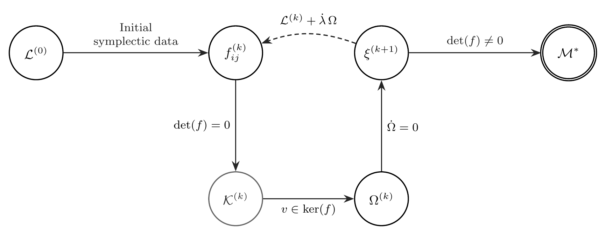
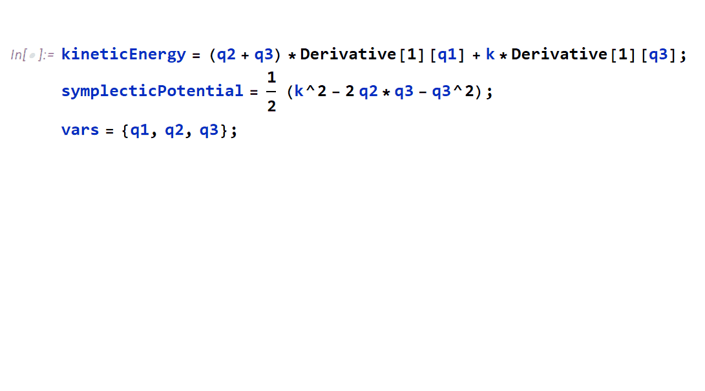
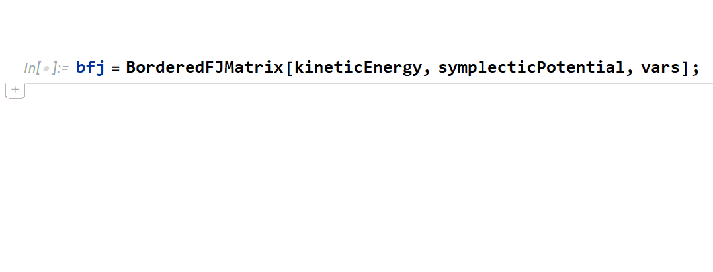

[](https://doi.org/10.5281/zenodo.18362979)


# BorderedFJReduction
Matrix bordering structure of the Faddeev-Jackiw algorithm: kernel reduction and symbolic automation.

> **BorderedFJReduction** is a symbolic computational engine that formalizes the Faddeev–Jackiw (FJ) reduction of singular Lagrangian systems as a geometrically constrained instance of the **Matrix Bordering Technique (MBT)**.
>
> Each consistency step of the Barcelos–Neto–Wotzasek algorithm is realized as a bordering of the pre-symplectic matrix. Because the pre-symplectic form is singular by hypothesis, the regularity of the resulting extended matrix is decided not by any inverse of that matrix, but by the **reduction to its null space**: the *reduced constraint matrix* $\Gamma = N^{\top} B$, built from the pairing of the constraint gradients with a basis $N$ of $\ker(f^{(0)})$, controls termination through an exact determinant factorization and coincides, coefficient by coefficient, with the Faddeev–Jackiw constraint algebra.
>
> **Project status:** *Published.* The theoretical formulation and software architecture correspond to the article **"Matrix bordering structure of the Faddeev–Jackiw algorithm: kernel reduction and symbolic automation"**, E. Chan–López, A. Martín–Ruiz, J. M. Cabrera and J. M. Paulin Fuentes, *The European Physical Journal Plus* **141**, 932 (2026), published open access on 14 August 2026, [doi:10.1140/epjp/s13360-026-08146-x](https://doi.org/10.1140/epjp/s13360-026-08146-x). An earlier version of the manuscript remains available as a preprint at [arXiv:2602.12114](https://arxiv.org/abs/2602.12114). The package is designed for analytical work on singular Lagrangians, emphasizing explicit constraint propagation and regularity diagnostics via null-space reduction and the reduced constraint matrix.

___

## 📦 BorderedFJReduction
<p align="center">  </p> <p align="left"> <b>Conceptual flow of the bordered Faddeev–Jackiw reduction, highlighting constraint propagation, null-space coupling, and the structural identification of gauge candidates.</b> </p>

___

## 🔍 Overview

BorderedFJReduction is a Wolfram Language paclet that provides a fully symbolic implementation of the Faddeev–Jackiw (FJ) reduction for singular Lagrangian systems.

The core contribution of this project is the realization that the FJ iterative extension of phase space is not a heuristic procedure, but a **geometrically constrained instance of the Matrix Bordering Technique (MBT)**, whose termination is governed by the reduction of the bordered matrix to the null space of the pre-symplectic form. This insight enables a deterministic, transparent, and automatable reduction process, preserving full parametric dependence throughout the computation.

The engine returns an opaque symbolic object encapsulating the complete symplectic hierarchy, while exposing its internal structure through a controlled, queryable interface.

**Scope of the engine.** The reduction terminates in exactly one of three states: the extended matrix is **regularized**, the consistency condition produces an **inconsistency**, or the recursion **stalls** in a way that is structurally compatible with a gauge symmetry. In the last case the engine reports a **candidate** and stops. It does not construct, classify or verify gauge generators; that analysis is developed in a companion engine and reported separately (see [Future Directions](#-future-directions)).

### Mathematical Foundation

For a first-order Lagrangian $L = a_i(\xi)\,\dot\xi^{\,i} - V(\xi)$ with singular pre-symplectic two-form $f^{(0)}_{ij} = \partial_i a_j - \partial_j a_i$, each iteration of the Barcelos–Neto–Wotzasek algorithm produces an antisymmetric **bordered** matrix

```math
f^{(m)} = \begin{pmatrix} f^{(0)} & B \\ -B^{\top} & 0 \end{pmatrix},
\qquad B_{j\alpha} = \frac{\partial \Omega_\alpha}{\partial \xi^{j}},
```

where the bordering block $B$ collects the gradients of the consistency constraints $\Omega_\alpha$. Since $f^{(0)}$ is singular, its inverse — and hence any determinantal identity that presupposes an invertible anchor — is unavailable. Regularity is instead controlled by how $B$ couples to $\ker(f^{(0)})$.

Let the columns of $N \in \mathbb{R}^{n\times d}$ be an orthonormal basis of $\ker(f^{(0)})$, with $d = \dim\ker(f^{(0)})$, and define the **reduced constraint matrix**

```math
\Gamma = N^{\top} B \in \mathbb{R}^{d\times k}, \qquad \Gamma_{a\alpha} = N_a^{\,i}\,\partial_i \Omega_\alpha .
```

Eliminating the invertible symplectic core of $f^{(0)}$ by an orthogonal congruence yields the **exact determinant factorization**

```math
\det\!\big(f^{(m)}\big) = \Big(\prod_{\ell} \mu_\ell^{2}\Big)\,\det(\Gamma)^2, \qquad \mu_\ell > 0,
```

where the $\mu_\ell$ are the Pfaffian factors of the nonsingular block of $f^{(0)}$. Because the prefactor is strictly positive, the extended matrix is regular **if and only if** the number of independent generated constraints equals $d$ and $\Gamma$ is nonsingular:

```math
\det\!\big(f^{(m)}\big) \neq 0 \iff k = d \ \text{ and }\ \det(\Gamma) \neq 0 .
```

The central algebraic result is the **kernel–Poisson identity**: when the constraints arise from the consistency condition, the reduced matrix equals, coefficient by coefficient, the Hessian of the symplectic potential restricted to the null space,

```math
\Gamma_{\alpha\beta} = N_\alpha^{\,i}\,\big(\partial_i\partial_j V\big)\,N_\beta^{\,j} = \{\Omega_\alpha,\Omega_\beta\}_{\mathrm{FJ}},
```

which is precisely the constraint matrix whose nondegeneracy characterizes a second-class system in the Dirac–Bergmann sense. This is an **exact matrix equality** — not an isomorphism, a congruence, or a relation valid only on the constraint surface.

The package automates the corresponding workflow:

* **Kernel reduction:** computes $\ker(f^{(m)})$ at every stage and the consistency contractions $v^{i}\partial_i V$ that generate the constraints $\Omega_\alpha$; regularity is decided by the rank of the bordered matrix, which by the factorization above is equivalent to $\det(\Gamma)\neq 0$.
* **Exact correspondence:** links the regularity of the bordered matrix directly to the second-class structure of the constraints through the kernel–Poisson identity.
* **Weak-vanishing constraint algebra:** decides whether a newly generated constraint is genuinely new by **ideal membership** (Gröbner normal form) rather than by linear independence, which is the correct notion of Dirac consistency for nonlinear constraints.
* **Candidate diagnostics:** reports a gauge **candidate**, with its branch, stage and multiplicity, when the recursion stalls with a residual kernel whose contractions vanish weakly.

> Under the assumption that the generated constraints are independent and the consistency algorithm has been run to exhaustion, the Faddeev–Jackiw reduction terminates in a nondegenerate symplectic form if and only if $\Gamma$ is nonsingular, i.e. the system is second-class.

-----

## ✨ Key Features

- Fully symbolic implementation of the Faddeev–Jackiw reduction
- Theorem-driven formulation based on the Matrix Bordering Technique (not a procedural algorithm)
- **Kernel (null-space) reduction** of singular pre-symplectic matrices via the reduced constraint matrix $\Gamma = N^{\top}B$
- Regularity governed by the exact determinant factorization $\det(f^{(m)}) = \big(\prod_\ell \mu_\ell^2\big)\det(\Gamma)^2$
- **Weak vanishing decided by ideal membership:** constraint novelty and candidate verdicts are computed as Gröbner normal forms modulo the ideal of the accumulated constraints, exact for nonlinear constraints and for trigonometric-polynomial data (via the embedding $\cos\theta\mapsto c$, $\sin\theta\mapsto s$ with the Pythagorean relations adjoined)
- Automatic classification of the terminal state:
  - Regularized symplectic manifolds
  - Constraint hierarchies generated by consistency conditions
  - **Gauge candidates**, in the null-contraction and dependent-constraint branches
  - **Inconsistent systems** (a nonvanishing, variable-free consistency condition)
- Exact preservation of parametric dependence throughout the reduction process
   (essential for bifurcation, stability, and structural analysis)
- Structured symbolic output encapsulated in a Wolfram `SummaryBox`
- Opaque but fully queryable association-based interface for downstream analysis
- Transparent accounting of the recursion: bordering rounds, algorithm passes, multipliers, constraints adjoined per round, and discarded (redundant or identically zero) candidates
- Direct access to:
  - Extended symplectic matrices
  - Generalized symplectic brackets
  - Constraint algebra and iteration metadata
- Publication-ready visualization of generalized symplectic structures

___

## 📐 Conceptual Architecture

The reduction process is internally organized as a **directed dependency graph** of symbolic states, rather than a linear algorithm.
Each iteration corresponds to a bordered extension of the symplectic 2-form until regularity, an inconsistency, or a residual kernel (gauge candidate) is detected.

This mirrors the interpretation developed in Sect. 3.1 of the published article, where such graphs are called *causal* only in the rewriting-system sense of the Wolfram Physics Project:

> The Faddeev–Jackiw procedure is a geometrically constrained matrix bordering process acting on symbolic symplectic data, whose termination is decided by the reduction to the null space of the pre-symplectic form.
___

## 📑 Table of Contents

- [🔧 Minimum Requirements](#-minimum-requirements)
- [🚀 Installation](#-installation)
- [🆕 What's New in v0.1.3](#-whats-new-in-v013)
- [🧪 Basic Usage](#-basic-usage)
- [🧩 API Summary](#-api-summary)
- [🧭 Gauge Candidate Identification](#-gauge-candidate-identification)
- [⚠️ Messages and Failure Modes](#️-messages-and-failure-modes)
- [📚 Scientific Context and Related Work](#-scientific-context-and-related-work)
- [📖 Publication](#-publication)
- 👥 [Authors' Contributions Statement](#-authors-contributions-statement)
- [🔮 Future Directions](#-future-directions)
- [🙏 Acknowledgements](#-acknowledgements)
- [📄 License](#-license)
- [📌 Citation and DOI](#-citation-and-doi)
- [📋 Development](#-development)

## 🔧 Minimum Requirements

- Wolfram Language / Mathematica **13.0 or later**
- Wolfram Workbench (Eclipse-based IDE) — *optional but recommended*
- Tested on Windows, macOS, and Linux

## 🚀 Installation
### Option 1: Install directly from GitHub (recommended)

```mathematica
PacletInstall[
  "https://github.com/echanlopez/BorderedFJReduction/releases/download/v0.1.3/BorderedFJReduction-0.1.3.paclet",
  ForceVersionInstall -> True
]
```
Then load the package:

```mathematica
Needs["BorderedFJReduction`"]
```
### Option 2: Local installation (development)

```mathematica
PacletInstall["/path/to/BorderedFJReduction-0.1.3.paclet"]
```

> **Note:** Release v0.1.3 supersedes earlier archived versions. Unlike v0.1.2,
> which was a packaging correction only, this release changes the reported
> verdict vocabulary and hardens the reduction itself; see
> [What's New in v0.1.3](#-whats-new-in-v013) before upgrading existing code.

## 🆕 What's New in v0.1.3

**Breaking change — verdict vocabulary.** The key `"GaugeSymmetry"` now reports

| Value | Meaning |
|---|---|
| `"CandidateFound"` | the recursion stalled on a kernel whose consistency contractions vanish weakly; a gauge symmetry is the expected, but **not certified**, explanation |
| `"NotCandidateFound"` | no such stall occurred along the path actually traversed |

The v0.1.2 values `"Found"` / `"NotFound"` are retired: they asserted a detection the engine never performed. Correspondingly, `"MatrixStatus"` reports `"GaugeCandidate"` instead of `"GaugeDetected"`, and every candidate halt stores `"GaugeAnalysis" -> Missing["NotAvailable", ...]` to make the boundary of the engine explicit. The prose key `"GaugeDetectionReason"` survives as a deprecated alias of `"GaugeCandidateReason"`, and `"PartialExtendedMatrix"` as a deprecated alias of `"ExtendedMatrix"`.

**Corrections to the reduction itself.**

- *Halting and iteration semantics.* The iteration predicate no longer evaluates the step function inside the test (every pass used to be computed twice, duplicating all Gröbner and `Simplify` work). `"IterationCount"` is now $m$, the number of **bordering rounds** — the superscript of $f^{(m)}$ — incremented only on extension; v0.1.2 incremented it by the *number of new constraints*, prematurely exhausting `"MaxIterations"`. The number of algorithm passes is reported separately as `"PassCount"`.
- *Input validation.* The kinetic term must be linear in the atomic velocities `Derivative[1][q]`; otherwise the engine issues a message and returns `$Failed` instead of silently building a velocity-dependent one-form.
- *Constraint novelty by ideal membership.* Redundancy is decided by the Gröbner normal form modulo the ideal of the accumulated constraints, which resolves the classical $q$ vs. $q^2$ pathology that defeats gradient-rank tests and no longer degenerates on trigonometric data.
- *Identically zero candidates* are discarded during the step and recorded in `"Diagnostics"`, never adjoined; v0.1.2 adjoined them, creating multipliers with zero coupling and hence permanent spurious null modes.
- *Multiplier collision.* Multipliers are numbered globally through `"MultiplierCount"`; successive rounds used to rebuild them from index 1 and collapse distinct multipliers into one variable.
- *Inconsistency detection.* A nonvanishing, variable-free consistency condition now halts with `"MatrixStatus" -> "Inconsistent"` instead of looping into a false gauge verdict.
- *Coherent summary on every halt.* The stage matrix, its rank and the structural counters are written on all three halts, so first-pass halts no longer display `Missing[KeyAbsent, ...]`.
- *Reload hygiene.* The public symbols no longer carry the `Locked` attribute, which forbade the `Unprotect` at the head of the package and broke every in-session reload.

**New conveniences.** A declarative call signature (an `Association` with the three system keys), the option `"TraceStages"`, and a per-stage record of the constraints adjoined in each round.

## 🧪 Basic Usage

A minimal invocation returns a structured symbolic object summarizing the
regularization status, constraint geometry, and phase-space extension of the system.

Example shown below: Faddeev–Jackiw reduction of the Singular Lagrangian with noncanonical kinetics
(details omitted for clarity; see the Examples/ folder for the full definition).

```mathematica
Needs["BorderedFJReduction`"]
```
The following animation illustrates only the final symbolic structured output for a typical reduction.

<p align="left">
  
</p>

🔎 **Technical notes**

- **Input/Output shown:** The animation displays the complete Lagrangian specification alongside the reduction's structured summary.

- **Parametric preservation:** Physical parameters (e.g., masses, spring constants, coupling terms) remain symbolic throughout the computation, enabling sensitivity analysis and parametric bifurcation studies without re-execution.

- **Design philosophy:** The output prioritizes *diagnostic information* (rank, iteration count, regularity status) over raw symbolic expressions, consistent with the package's emphasis on geometric structure rather than algebraic manipulation.

In practice, the output of `BorderedFJMatrix` is typically assigned to a symbolic
object. This allows direct programmatic access to the internal structures generated
by the reduction, such as constraints, extended symplectic matrices, and iteration
metadata.

```mathematica
bfj = BorderedFJMatrix[kineticEnergy, symplecticPotential, vars];
```

The system may also be supplied declaratively, as an `Association` carrying the
three system keys; extra keys are ignored:

```mathematica
bfj = BorderedFJMatrix[<|
  "kinetic-energy"        -> kineticEnergy,
  "symplectic-potential"  -> symplecticPotential,
  "vars"                  -> vars|>];
```

**Options**

| Option | Default | Effect |
|---|---|---|
| `"MaxIterations"` | `5` | upper bound on **bordering rounds** (not on passes); the terminal readout pass is always granted |
| `"TraceStages"` | `False` | when `True`, records a per-pass trace under `"StageData"`: kernel, contractions, and the transient / persistent split of the null vectors |

The returned object supports the following query interface:

```mathematica
bfj["Constraints"]
bfj["ExtendedMatrix"]
bfj["ExtendedOneForm"]
bfj["ExtendedSymplecticVariables"]
bfj["InverseExtendedMatrix"]
bfj["MatrixStatus"]
bfj["GaugeSymmetry"]
bfj["IterationCount"]
bfj["PassCount"]
bfj["Properties"]
```

Here `"MatrixStatus"` reports the terminal state of the reduction, which by the
factorization $\det(f^{(m)}) = \big(\prod_\ell \mu_\ell^2\big)\det(\Gamma)^2$ is
governed by $\det(\Gamma)$:

| `"MatrixStatus"` | Meaning |
|---|---|
| `"Regularized"` | the bordered matrix has full rank ($\det(\Gamma)\neq 0$): a second-class system, and `"InverseExtendedMatrix"` holds the generalized brackets |
| `"GaugeCandidate"` | the recursion stalled with a residual kernel whose contractions vanish weakly |
| `"Inconsistent"` | the consistency condition produced a nonvanishing, variable-free constraint |

The status `"NotRegularized"` is computed internally but never appears in a
returned object: that case exhausts `"MaxIterations"` and the engine issues
`BorderedFJMatrix::iter` and returns `$Failed`. The generated `"Constraints"` are
the functions $\Omega_\alpha$ whose gradients form the bordering block $B$, and
`"InverseExtendedMatrix"` returns the generalized symplectic brackets of the
regularized theory.

The two counters answer different questions and satisfy two invariants worth
using as an audit:

```mathematica
Length[bfj @ "ConstraintsPerStage"] === bfj @ "IterationCount"   (* rounds *)
Total [bfj @ "ConstraintsPerStage"] === bfj @ "MultiplierCount"  (* multipliers *)
```

`"IterationCount"` counts bordering rounds; `"PassCount"` counts algorithm passes,
which exceeds the former by the terminal readout pass. When several constraints
are adjoined simultaneously — as in the ring of masses and springs, where both
shadows of $\nabla V$ on a two-dimensional kernel are adjoined at once — a single
round produces several multipliers and there is no intermediate stage in the
recursion.

To visualize the generalized symplectic brackets in a structured,
publication-ready format:

```mathematica
FJSymplecticFrame[bfj]
```

<p align="left">
  
</p>

**Note:** The visualization shows the extended symplectic structure with publication-ready formatting, including the inverse matrix (generalized brackets) and diagnostic information. It applies only to a regularized reduction; on any other object it issues `FJSymplecticFrame::noinv` and returns `$Failed`.

## 🧩 API Summary

The object returned by `BorderedFJMatrix` is intentionally opaque but fully queryable. The keys actually present depend on the halt and are advertised by `"Properties"`.

**Structural data (all halts)**

- `"Constraints"` — generated constraint functions $\Omega_\alpha$
- `"ExtendedMatrix"` — final bordered symplectic matrix $f^{(m)}$
- `"ExtendedMatrixRank"` — rank of $f^{(m)}$
- `"ExtendedOneForm"` — extended canonical one-form
- `"ExtendedSymplecticVariables"` — augmented phase-space variables (including Lagrange multipliers)
- `"MatrixStatus"` — `"Regularized"`, `"GaugeCandidate"` or `"Inconsistent"`
- `"GaugeSymmetry"` — `"CandidateFound"` or `"NotCandidateFound"`

**Recursion accounting**

- `"IterationCount"` — number of bordering rounds $m$, the superscript of $f^{(m)}$
- `"PassCount"` — number of algorithm passes, including the terminal readout
- `"ConstraintsPerStage"` — constraints adjoined in each round
- `"MultiplierCount"` — total number of Lagrange multipliers introduced
- `"ConstraintsLength"` — number of surviving constraints
- `"RedundantConstraints"` — candidates discarded as weakly zero (in the ideal of the accumulated constraints)
- `"Diagnostics"` — record of null-constraint and redundancy events
- `"StageData"` — per-pass trace, when `"TraceStages" -> True`

**Regularized halt**

- `"InverseExtendedMatrix"` — generalized symplectic brackets

**Gauge-candidate halt**

- `"GaugeCandidateBranch"` — `"ZeroContraction"` or `"DependentConstraints"`
- `"GaugeCandidateReason"` — prose statement of the branch, the halting stage $f^{(m)}$ and the kernel dimension
- `"GaugeCandidateMethod"` — the ideal-membership method behind the verdict
- `"KernelDimension"` — $\dim\ker f^{(m)}$ at the stall
- `"CandidateMultiplicity"` — number of independent candidate directions
- `"GaugeAnalysis"` — `Missing["NotAvailable", ...]`: generator construction is out of scope

**Inconsistent halt**

- `"InconsistencyWitness"` — the offending variable-free constraint
___

## 🧭 Gauge Candidate Identification

If the reduction stalls with a residual kernel — i.e. $\det(\Gamma) = 0$ — the extended matrix is not regularized, and the engine reports the structural signature that produced the stall:

- **Null contractions** (`"ZeroContraction"`): every consistency contraction $v^{i}\partial_i V$ of the kernel of $f^{(m)}$ vanishes identically, so no new constraint can be generated.

- **Dependent constraints** (`"DependentConstraints"`): every informative candidate lies in the **ideal** of the accumulated constraints, so it vanishes on the constraint surface and restricts the phase space no further. Redundancy here is weak vanishing in the Dirac sense, decided by a Gröbner normal form — not linear independence of gradients.

Both are **necessary** signatures of first-class content, not sufficient ones, which is exactly why the verdict is `"CandidateFound"` rather than a detection. The engine therefore reports the branch, the halting stage, the kernel dimension and the number of independent candidate directions, and stops there: it constructs no generator, no infinitesimal transformation and no canonical charge.

The halting matrix $f^{(m)}$ is stored on every halt, so the candidate directions themselves remain recoverable by the user:

```mathematica
NullSpace[bfj @ "ExtendedMatrix"]
```

and, with `"TraceStages" -> True`, the per-pass kernels, contractions and the transient / persistent split are available under `"StageData"`.

A stall whose contractions do *not* vanish weakly is no longer read as a gauge situation: a nonvanishing, variable-free consistency condition is now reported explicitly as `"MatrixStatus" -> "Inconsistent"` with its witness.

**Why "candidate" is the correct word.** The residual kernel of the extended matrix is routinely read as the space of gauge generators. That reading is not merely imprecise. Consider the following four-variable system, taken from the companion work — E. Chan–López, *From Null Modes to Gauge Generators: A Bordered Faddeev–Jackiw Theory of Constraint Chains* (preprint), where it is established as a structural result rather than an illustration:

```mathematica
counterexample = <|
  "kinetic-energy"       -> q2 Derivative[1][q1],
  "symplectic-potential" -> q1 q3 + q2 q4,
  "vars"                 -> {q1, q2, q3, q4}|>;

BorderedFJMatrix[counterexample]
(* "GaugeSymmetry" -> "CandidateFound", branch "DependentConstraints",
   "KernelDimension" -> 2 *)
```

The engine halts with a two-dimensional residual kernel whose contractions both lie in the constraint ideal — the textbook signature of gauge freedom. Yet the Euler–Lagrange equations of this Lagrangian read $\dot q_2 = -q_3$, $\dot q_1 = q_4$, $q_1 = 0$, $q_2 = 0$, so $q_1 \equiv q_2 \equiv 0$ and, differentiating, $q_3 = q_4 = 0$. The solution is unique: the system has **zero degrees of freedom and admits no gauge transformation whatsoever**.

The mechanism is visible in the potential itself, which depends on the degenerate coordinates only through the constraints, $V = q_3\Omega_1 + q_4\Omega_2$. Every contraction is then automatically in the ideal, and no ideal-membership test — however exact — can tell this situation apart from genuine gauge freedom. What the bordering does is insert $\dot\lambda^\alpha$ into the equations of motion, absorbing precisely the terms that determined $q_3$ and $q_4$; the resulting freedom belongs to the extended system, not to the original one.

Reporting such a halt as a detection would therefore be an error rather than an approximation, and no amount of extra bookkeeping inside this engine would repair it: what separates a genuine generator from a mere null direction is a criterion that lives outside the reduction. That criterion — together with the analysis of this counterexample, the chain structure that rejects its false candidates, and the decomposition of the residual kernel — is developed in the companion work cited above.

___

## ⚠️ Messages and Failure Modes

| Message | Condition | Result |
|---|---|---|
| `BorderedFJMatrix::lin` | the kinetic term is not linear in `Derivative[1][q]` (the Lagrangian is not first-order) | `$Failed` |
| `BorderedFJMatrix::maxit` | `"MaxIterations"` is not a positive integer or `Infinity` | `$Failed` |
| `BorderedFJMatrix::iter` | the allowed bordering rounds were exhausted with the matrix still unregularized | `$Failed` |
| `BorderedFJMatrix::incons` | a nonvanishing, variable-free consistency condition was generated | object with `"MatrixStatus" -> "Inconsistent"` |
| `BorderedFJMatrix::nonpoly` | the constraint data is neither polynomial nor trigonometric-polynomial, so ideal membership falls back to generic gradient rank over the function field; issued at most once per run | object, with generic (not ideal-theoretic) verdicts |
| `FJSymplecticFrame::noinv` | the object carries no `"InverseExtendedMatrix"` | `$Failed` |

___


## 📚 Scientific Context and Related Work

The theoretical foundation of this package is rooted in the geometric formulation of constrained dynamics introduced by Faddeev and Jackiw, which recasts singular Lagrangian systems in terms of pre-symplectic structures rather than hierarchical constraint classifications.

The full iterative power of the method was developed by Barcelos-Neto and Wotzasek, who established a systematic procedure for extending the phase space until either a regular symplectic manifold or a gauge symmetry is revealed.

From a linear-algebra perspective, the present implementation makes explicit the connection between the Faddeev–Jackiw iteration and the Matrix Bordering Technique, a classical tool in numerical analysis and bifurcation theory for handling rank-deficient operators and structured singularities. The specific contribution here is to show that, for the singular anchor of a pre-symplectic form, regularity is decided by the reduction to the null space: the reduced constraint matrix $\Gamma = N^{\top}B$ factorizes the determinant of the bordered matrix and coincides exactly with the Faddeev–Jackiw constraint algebra.

Compared with procedural computer-algebra treatments — which typically carry explicit time dependencies $q_i(t)$ and re-derive the constraint hierarchy at each step — the present engine adopts a declarative, association-based design: the physical system is a static specification of structural data, phase-space coordinates are atomic symbols, and the reduction is a deterministic transformation of symbolic states. This preserves parametric dependence exactly and keeps the focus on the algebraic structure of the constraints.

This package accompanies the theoretical development presented in:

> **Matrix bordering structure of the Faddeev–Jackiw algorithm:  
> kernel reduction and symbolic automation**  
> E. Chan–López, A. Martín–Ruiz, J. M. Cabrera and J. M. Paulin Fuentes,  
> *Eur. Phys. J. Plus* **141**, 932 (2026).  
> [doi:10.1140/epjp/s13360-026-08146-x](https://doi.org/10.1140/epjp/s13360-026-08146-x)

The implementation has been validated on:

- Singular Lagrangian system with noncanonical kinetic structure
- Singular mechanical systems analyzed within the Dirac–Bergmann framework  
- Systems exhibiting gauge symmetry, reported here as candidates

>**These examples illustrate how the symbolic engine bridges abstract symplectic geometry with concrete mechanical realizations.**

> **This software is not a replacement for Dirac–Bergmann methods, but a complementary algebraic formulation.**

___

## 📖 Publication

**Published article:**

> **Matrix bordering structure of the Faddeev–Jackiw algorithm:  
> kernel reduction and symbolic automation**  
> E. Chan–López, A. Martín–Ruiz, J. M. Cabrera and J. M. Paulin Fuentes,  
> *Eur. Phys. J. Plus* **141**, 932 (2026). Open access.  
> [doi:10.1140/epjp/s13360-026-08146-x](https://doi.org/10.1140/epjp/s13360-026-08146-x)

**Preprint (earlier version):**

> [arXiv:2602.12114](https://arxiv.org/abs/2602.12114) [math-ph], submitted 12 February 2026.  
> Superseded by the published article above.

The present release provides a fully functional symbolic engine designed to:
- establish computational reproducibility,
- provide an inspectable implementation of the theoretical results,
- and enable automated analysis of singular Lagrangians and their constraint structures.

The theoretical framework, its proofs and its validation benchmarks are established in the published article; their computational counterpart — the executable reproduction of every reported reduction — is documented in the `BorderedFJReduction_Examples.nb` notebook within the `Examples` directory.
___

## 👥 Authors' Contributions Statement

- **Ramón Eduardo Chan López** (SECIHTI-DACB-UJAT): *Original Idea, Conceptualization, Methodology, Software (Lead Architect & Developer), Formal Analysis, Investigation, Writing – Original Draft, Validation, Package Maintenance.*
- **José Alberto Martín Ruiz** (ICN-UNAM, C3-UNAM): *Conceptualization, Formal Analysis, Software (Package Contributor), Writing – Review & Editing.*
- **Jaime Manuel Cabrera** (SECIHTI-DACB-UJAT): *Review & Editing.*
- **Jorge Mauricio Paulin Fuentes** (DACB-UJAT): *Review & Editing.*

___

## 🔮 Future Directions

The current engine targets finite-dimensional systems (point mechanics) and stops at the identification of gauge candidates.
The structural analysis of those candidates — construction of the generators, their independence and degeneracy loci, and the associated canonical charges — is developed in a companion engine and reported in **"From Null Modes to Gauge Generators: A Bordered Faddeev–Jackiw Theory of Constraint Chains"** (E. Chan–López, preprint). This repository deliberately stops at the identification of candidates.
Beyond that, the algebraic architecture is designed as a kernel for future extensions toward:

- Field theories
- Symbolic tensor calculus
- Infinite-dimensional constraint surfaces
- Gauge theories (Maxwell, Yang–Mills)

The long-term vision is a Tensor Faddeev–Jackiw Engine, where constraint handling emerges directly from the algebraic structure of the symplectic form.

### **Extension to infinite-dimensional settings (remarks)**
The algebraic logic underlying matrix bordering and kernel reduction admits operator-theoretic generalizations.
In the transition to continuum systems, the finite-dimensional pre-symplectic matrices are replaced by integro-differential operators and the null-space reduction lifts to the corresponding operator setting. Bordered and reduced-operator constructions of this kind have been systematically studied for bounded and complementable operators on Hilbert spaces, providing a mathematically consistent backdrop for infinite-dimensional extensions under suitable analytic hypotheses.

**References on Matrix Bordering and reduced-operator constructions:**

- G. H. Golub and C. F. Van Loan, *Matrix Computations*, 4th ed., 
  Johns Hopkins University Press (2013).  
  Chapter 3 discusses matrix bordering techniques and their applications 
  in numerical linear algebra.

- A. Galántai, *Rank reduction and bordered inversion*, 
  Linear Algebra and its Applications **336** (2001), 97–104.  
  Rank-reduction framework for bordered matrices underlying the determinant factorization.

- C. Băcuţă, *Schur complements on Hilbert spaces*, 
  Journal of Computational and Applied Mathematics **231** (2009).  
  https://www.sciencedirect.com/science/article/pii/S0377042708004305  
  Operator-theoretic backdrop relevant to infinite-dimensional extensions.
___

## 🙏 Acknowledgements

The lead developer of the software would like to acknowledge **[Eric Rimbey](https://community.wolfram.com/web/eric3)** for his critical feedback and rigorous code reviews during the early stages of this project.

His emphasis on immutability, explicit semantic structure, and disciplined control of symbolic state played a decisive role in shaping the final design philosophy of the engine. Several aspects of the current implementation—particularly its rule-based structure and transparent error handling—are a direct consequence of those early discussions.

Contributions of this kind, grounded in systems thinking and semantic rigor, are fundamental to the maturation of reliable scientific software, even when their impact is primarily architectural rather than directly visible in the final code.

___

## 📄 License

This project is released under the MIT License.

The software is intended for academic and research use, providing a transparent and reproducible implementation of the methods described in the published article.

___
## 📌 Citation and DOI

If you use this software in academic work, please cite both the article and the archived software release, using the following DOIs:

- **Article DOI (Eur. Phys. J. Plus 141, 932 (2026)):** https://doi.org/10.1140/epjp/s13360-026-08146-x  
- **Concept DOI (all software versions):** https://doi.org/10.5281/zenodo.18362979  
- **Version-specific DOI (v0.1.3 – recommended):** https://doi.org/10.5281/zenodo.22135003  
- **Version-specific DOI (v0.1.2 – superseded):** https://doi.org/10.5281/zenodo.18487436  
- **Version-specific DOI (v0.1.1 – superseded):** https://doi.org/10.5281/zenodo.18362980
___

## BibTeX Citation

If you use **BorderedFJReduction** in your research, please cite the published article and, where the specific release matters, the archived software:

### Article

```bibtex
@article{ChanMartinBorderedFJReduction,
  title   = {Matrix bordering structure of the Faddeev--Jackiw algorithm:
             kernel reduction and symbolic automation},
  author  = {Chan--L{\'o}pez, E. and
             Mart{\'\i}n--Ruiz, A. and
             Cabrera, Jaime Manuel and
             Paulin Fuentes, Jorge Mauricio},
  journal = {The European Physical Journal Plus},
  volume  = {141},
  pages   = {932},
  year    = {2026},
  issn    = {2190-5444},
  publisher = {Springer Berlin Heidelberg},
  doi     = {10.1140/epjp/s13360-026-08146-x}
}
```
### Software

```bibtex
@software{ChanLopez_BorderedFJReduction_2026,
  author    = {Chan--L{'o}pez, Ram{'o}n Eduardo},
  title     = {BorderedFJReduction: 
  A Symbolic Engine for the Faddeev--Jackiw Reduction as Constrained Matrix Bordering},
  version   = {0.1.3},
  year      = {2026},
  publisher = {Zenodo},
  doi       = {10.5281/zenodo.22135003},
  url       = {https://github.com/echanlopez/BorderedFJReduction}
}
```

## 📋 Development

For maintainers and contributors:

- [Release checklist](docs/RELEASE_CHECKLIST.md)
